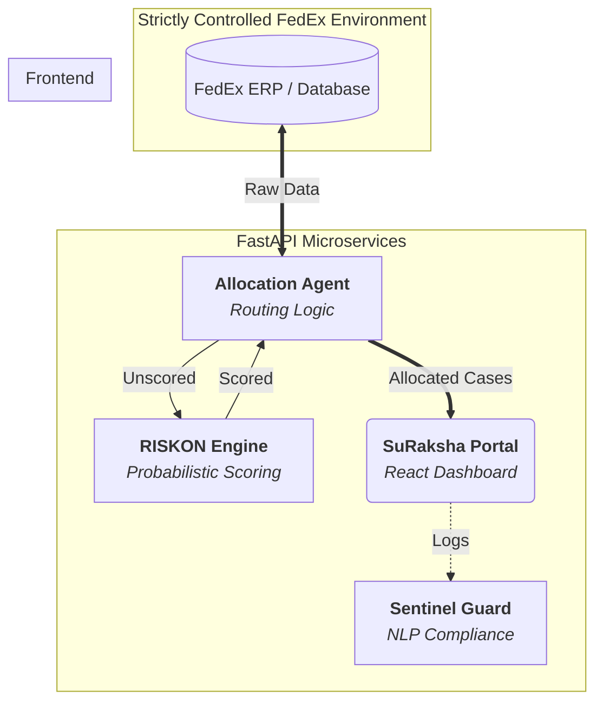

# RecoverAI System Architecture

The system follows a linear **"Ingest -> Smarten -> Execute -> Govern"** pipeline.

## High-Level Data Flow

1.  **Ingest (ERP -> Core):** Raw invoice data is pulled from the ERP.
2.  **Smarten (Core -> RISKON):** Data is scored using the ODE Model to determine `P(Recovery)`.
3.  **Execute (Core -> Portal):** Cases are routed to the SuRaksha Portal for agent action.
4.  **Govern (Portal -> Sentinel):** Interaction logs are analyzed in real-time for compliance risks.

## Diagram

